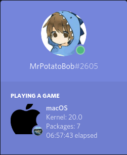
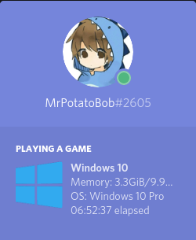
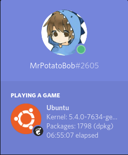
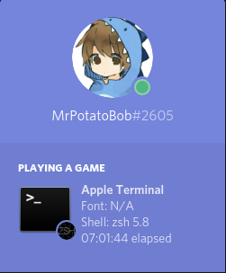
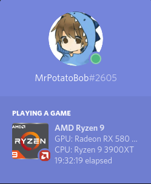
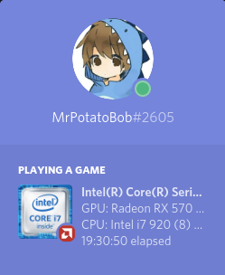
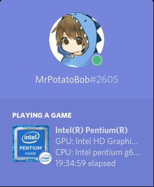

<h1 align="center">FetchCord</h1>

    
  
   
    

# Table of content
- [**Features**](#features)
- [**To-Do**](#to-do)
+ **Installing**
    - [Install on (gnu/)linux](#installing-on-gnulinux)
    - [Install on MacOS](#installing-on-macos)
    - [Install on Windows](#installing-on-windows)
 + **Running**
    - [Running on (gnu/)linux](#run)
    - [Running on MacOS](#run-1)
    - [Running on Windows](#run-2)
- [**Configuration**](#Configuration)
- [**Arguments**](#arguments)

+ [**Examples**](#examples)

### Features

- [x] Distribution detection
 
- [x] Distribution Version

- [x] Package detection

- [x] Kernel Detection

- [x] Uptime

- [x] Detecting Window Manager/Desktop Environment

- [x] Detecting GPU/CPU and display it in a cycle (thanks to Hyper-KVM)

- [x] Flatpak support

- [x] Add Windows support.

- [x] Detect Window Manager/Desktop Environment version

- [x] Periodic polling of info such as package count, RAM usage, etc.

### To-Do

- [ ] Add more distributions (If your distro is not supported open an issue)

- [ ] Add Snap support

- [ ] Add support for desktop icon use

- [ ] More CPUs, ex. Pentium, Older AMD CPUs

- [ ] More GPUs?

## Installing on (GNU/)Linux
NOTE: you need neofetch to be also installed for this to work.
#### Via AUR
On Arch Linux install this package for the git version: [fetchcord-git](https://aur.archlinux.org/packages/fetchcord-git/)

Do note that this version is directly from master, for the stable release use [pip](#via-pip)
#### Via pip
To Install fetchcord via pip you can run `pip3 install fetchcord`

If you want to remove FetchCord you can run `pip3 uninstall fetchcord`

### Run

Once installed, simply run `fetchcord`. The program is also daemonizable meaning you can start it on boot using any method you prefer.

If you get `fetchcord: command not found`,add `export PATH="$HOME/.local/bin:$PATH"` to your bashrc, or just run `python3 -m fetchcord`.

Optionally for systemd users there is a user-side `fetchcord.service` in this repo that can be installed to `~/.local/share/systemd/user/`, started and enabled on boot using `systemctl --user enable --now fetchcord`.

## Installing on MacOS

To install FetchCord, run `pip3 install FetchCord`

NOTE: you need neofetch to be also installed for this to work.

### Run 

simply run `fetchcord`

## Installing on Windows

To install fetchcord on Windows run `python -m pip install fetchcord neofetch-win`. Alternatively, you can use the neofetch package from scoop as well (show more info at the expense of possible GPU detection, for now).

### Run
To run Fetchcord run `fetchcord`

### Configuration

On Linux you can use the neofetch config file to:

Show disk usage

Battery level

CPU temp

Current CPU speed

Font

Theme

And more

default config path should be `~/.config/neofetch/config.conf`

## Arguments
--nodistro, Don't show distro info.

--nohardware, Don't show hardware info.

--noshell, Don't show shell/terminal info.

--nohost, Don't show host info.

--time, -t, set custom duration for cycles in seconds.

--terminal, set custom terminal (useful if using a script or dmenu).

--termfont, set custom terminal font (useful if neofetch can't get it).

--pause-cycle, Extra cycle that pauses FetchCord to show other activities.

--update, Update database of distros, hardware, etc.

--debug, For debug logs.

--memtype, use GB or MB to show RAM.

-h or --help, shows this information above.
## Examples

### Operating Systems
  
### Terminals
  
### Cpus
  
### Hosts
  
