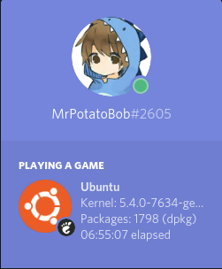

<h1 align="center">FetchCord</h1>
</p>
<p align="center">
    <a href="https://img.shields.io/badge/Compatible-MacOS%2FWindows%2FLinux-brightgreen?style=for-the-badge&logo=discord">
       
    </a>
    <a href="https://www.python.org/downloads/">
       
    </a>
   <a href="https://discord.gg/P4h9kdV">
       
    </a>
    <a href="https://img.shields.io/badge/Compatible-MacOS%2FWindows%2FLinux-brightgreen?style=for-the-badge&logo=discord">
       
  </a>
</p>

# Table of content

- [**Features**](#features)
- [**To-Do**](#to-do)
- **Installing**
  - [Install on (gnu/)linux](#installing-on-gnulinux)
  - [Install on MacOS](#installing-on-macos)
  - [Install on Windows](#installing-on-windows)
- **Running**
  - [Running on (gnu/)linux](#run-on-linux)
  - [Running on MacOS](#run-on-macos)
  - [Running on Windows](#run-on-windows)
- [**Configuration**](#configuration)
- [**Arguments**](#arguments)
- [**Website**](#website)

## Features

- [x] Distribution detection

- [x] Distribution Version

- [x] Package detection

- [x] Kernel Detection

- [x] Uptime

- [x] Detecting Window Manager/Desktop Environment

- [x] Detecting GPU/CPU and display it in a cycle

- [x] Flatpak support

- [x] Add Windows support.

- [x] Detect Window Manager/Desktop Environment version

- [x] Periodic polling of info such as package count, RAM usage, etc.

## To be tested

- [ ] Snap support

## To-Do

- [ ] Add more distributions (If your distro is not supported open an issue)

- [ ] Add support for desktop icon use

- [ ] More CPUs, ex. Pentium, Older AMD CPUs

- [ ] More GPUs?

## Installing on (GNU/)Linux

**Requirements: Python 3.12+ and fastfetch**

### Via pip (recommended)

To install fetchcord via pip you can run `pip3 install fetchcord`

If you want to remove FetchCord you can run `pip3 uninstall fetchcord`

### Via AUR

On Arch Linux for the git testing version (the less stable version): [fetchcord-testing](https://aur.archlinux.org/packages/fetchcord-testing/)

And the git version (synced with master): [fetchcord](https://aur.archlinux.org/packages/fetchcord/)

### Via Snap

On systems with snap installed, you can run `sudo snap install fetchcord --classic` to install fetchcord.

Note that like the AUR version, this version is directly from master, for the stable release use [pip](#via-pip-recommended) <!-- remove this if you're not automatically deploying it -->

### Run on Linux

Once installed, simply run `fetchcord`. The program is also daemonizable meaning you can start it on boot using any method you prefer.

If you get `fetchcord: command not found`,add `export PATH="$HOME/.local/bin:$PATH"` to your bashrc, or just run `python3 -m fetch_cord`.

Optionally for systemd users there is a user-side `fetchcord.service` in this repo that can be installed to `~/.local/share/systemd/user/`, started and enabled on boot using `systemctl --user enable --now fetchcord`.

## Installing on MacOS

**Requirements: Python 3.12+ and fastfetch**

### Via Homebrew (recommended)

FetchCord ships a Homebrew formula. Install it with:

```bash
brew tap fetchcord/homebrew-fetchcord
brew install fetchcord
```

`brew install` pulls in `fastfetch` automatically. The tap repository is
`github.com/fetchcord/homebrew-fetchcord`; the formula itself lives in this
repo at `Formula/fetchcord.rb`. To test the formula locally without a tap:

```bash
brew install --build-from-source ./Formula/fetchcord.rb
```

The tap's own CI keeps the formula up to date: a scheduled workflow
(`homebrew-tap/update-formula.yml`, copied into the tap) watches FetchCord
for new releases and updates the formula's `url`/`sha256` automatically.

### Via pip

```bash
pip3 install fetchcord
```

### Uninstall

```bash
brew uninstall fetchcord
# or, if installed via pip
pip3 uninstall fetchcord
```

### Run on MacOS

Once installed, simply run `fetchcord`. The program is also daemonizable meaning you can start it on boot using any method you prefer.

If you get `fetchcord: command not found`,add `export PATH="$HOME/.local/bin:$PATH"` to your zshrc, or just run `python3 -m fetch_cord`.

## Installing on Windows

**Requirements: Python 3.12+**

To install fetchcord on Windows run `pip3 install fetchcord` or `python3 -m pip install fetchcord`.

### Run on Windows

To run Fetchcord run `fetchcord`

If you get `fetchcord: command not found`, add your python scripts folder to your PATH or use `python3 -m fetch_cord`.

## What's New in 3.0.0

### Breaking Changes
- **Python 3.10+ is now required** (dropped support for older versions)
- Migrated from `neofetch` to `fastfetch` for system info detection
- Complete architecture rewrite with new module structure

### New Features
- **Improved Security**: Input validation and sanitized shell commands
- **Better Performance**: Refactored code with constants and reduced duplication
- **Modern Python**: Using Python 3.10+ features (union types with `|`, better type hints)
- **Better Packaging**: Added `pyproject.toml` for modern Python packaging
- **Comprehensive Tests**: 32 tests covering all modules

### Architecture Changes
The codebase has been completely rewritten with a modular architecture:
- **Config**: YAML configuration management
- **Cycle**: Discord Rich Presence cycle handling
- **Fetch**: System information fetching with fastfetch
- **Tools**: Utility functions for command execution
- **Constants**: Centralized configuration values

## Arguments

--nodistro, Don't show distro info.

--nohardware, Don't show hardware info.

--noshell, Don't show shell/terminal info.

--nohost, Don't show host info.

--time, -t, set custom duration for cycles in seconds.

--install, Install fetchcord as a systemd service and enable it.

--uninstall, Uninstall fetchcord systemd service.

--enable, Enable fetchcord systemd service.

--disable, Disable fetchcord systemd service.

--start, Start fetchcord systemd service.

--stop, Stop fetchcord systemd service.

--status, Check fetchcord systemd service status.

--update, Update database of distros, hardware, etc.

--testing, Get files from testing branch (for development).

--debug, -d, Enable debugging output.

--version, -v, Print FetchCord version.

-h or --help, Show help message.

## Website

Fetchcord now has a website! You can find this site over at https://fetchcord.github.io/ - please keep in mind this site is still currently work in progress though.

## Examples

### Operating Systems

  

### Terminals

  

### Cpus

  

### Hosts

  
