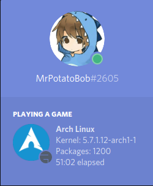
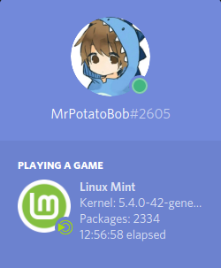
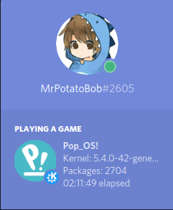
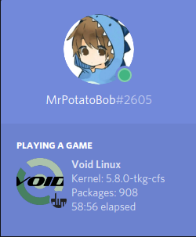
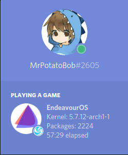
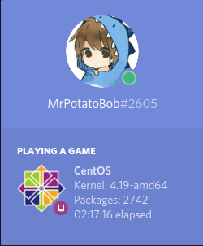
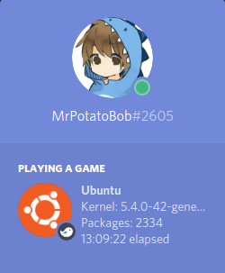
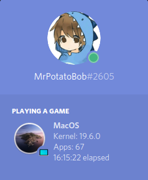
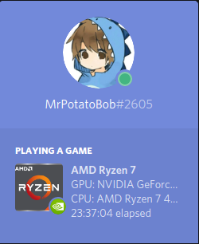

<h1 align="center">FetchCord</h1>
</p>
<p align="center">
    <a href="https://img.shields.io/badge/Compatible-MacOS%2FWindows%2FLinux-brightgreen?style=for-the-badge&logo=discord">
       
    </a>
  <a href="https://www.python.org/downloads/">
       
    </a>
   <a href="https://discord.gg/P4h9kdV">
       
    </a>
    <a href="https://img.shields.io/badge/Compatible-MacOS%2FWindows%2FLinux-brightgreen?style=for-the-badge&logo=discord">
       
  
  </a>
</p>

# Table of content
- [**Features**](#features)
- [**To-Do**](#to-do)
- [**Install on (gnu/)linux**](#installing-on-gnulinux)
    - [Running on (gnu/)linux](#run)
- [**Install on MacOS**](#installing-on-macos)
    - [Running on MacOs](#run-1)
- [**Examples**](#examples)

### Features

- [x] Distribution detection
 
- [x] Distribution Version

- [x] Package detection

- [x] Kernel Detection

- [x] Uptime

- [x] Detecting Window Manager/Desktop Environment

- [x] Detecting GPU/CPU and display it in a cycle (thanks to Hyper-KVM)
- [x] Flatpak support

### To-Do

- [ ] Add more distributions (If your distro is not supported open an issue)

- [ ] Detect Window Manager/Desktop Environment version

- [ ] Add Snap support

- [ ] Add support for desktop icon use

- [ ] More CPUs, ex. Pentium, Older AMD CPUs

- [ ] More GPUs?


## Installing on (GNU/)Linux
> `#` the command should be ran as `sudo`

> `$` the command should be ran as user

_From download/cloned directory_

```sh
# ./install.sh
```
You will also need the ` pypresence` module, install it by doing
```sh
$ python3 -m pip install --user pypresence
```
### Run

To run the script simply run `fetchcord`.

Alternativley you can run it without installing, you have to be in the fetchcord directory.
```sh
$ python3 run-rpc.py
```

#### Arguments
--distro, shows only distro and kernel version and package count.

--hardware, shows only CPU and GPU info.

--shell, shows only terminal and shell info.

--time, -t, set custom duration for cycles in seconds.

-h or --help, shows this information above.

## Installing on MacOS


_From download/cloned directory_

```sh
# ./macinstall.sh
```


### Run 

```sh
$ python3 -u -m fetch_cord.macos-rpc.py
```

## Examples

  

  

  

  




