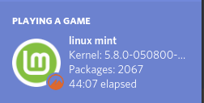
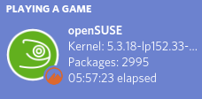
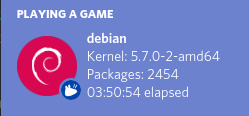

# FetchCord

Fetchcord grabs information about your Distro and displays it as Discord Rich Presence

## Examples
  
## What works

- [x] Distro detection

- [x] Package detection

- [x] Kernel Detection

- [x] Uptime

- [x] Distro version
- [x] Detect wm/de

## To-Do(What doesn't work)

- [ ] Add more distros

- [ ] Detect wm/de version

## Running

To run the scrip simply run `python3  run-rpc.py`, python 3.8 should have the `distro` module but if you get an error install it via pip, `pip3 install distro`
## If your distro or de/wm isn't supported, make an issue
##  Other Examples

 

  

  

